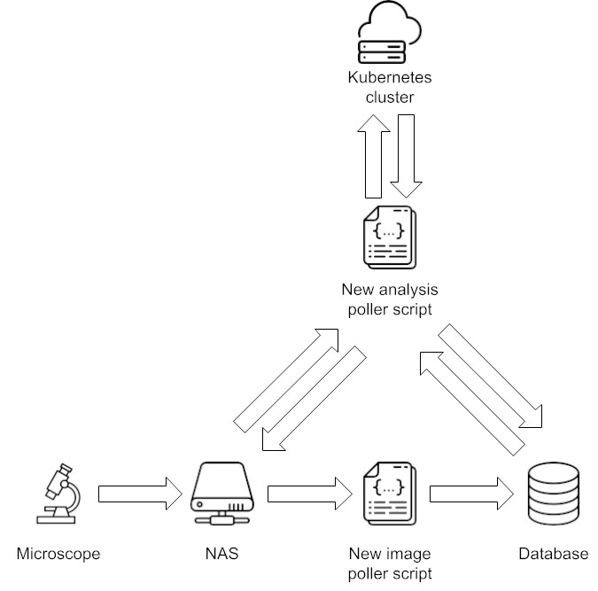

# Continuous Cellpainting - Cellprofiler pipelines automation on Kubernetes

This component handles the running of jobs on Kubernetes and collecting the results. It polls the database for non-started analyses that have completed plate acquisitions available. The analyses are sent as jobs to the Kubernetes cluster and once they are finished the results will be collected and stored at the same location as the images and the database will be updated and mark the analysis as finished. 



### In a nutshell

1. Get all non-started analyses.
1. Check if their plate acquisition is completed.
    1. If so, go through the specified analysis and submit all steps. If not, skip it for now.
    1. If a step is to be split into smaller batches, submit as 1 job per batch.
    1. If not, submit as 1 job for all images in plate acquisition.
1. Check if there are any started analyses that have not finished yet.
    1. If so, check if all jobs belonging to the analysis are finished. If not, skip it for now.
    1. If so, copy the results to the plate acquisition folder on the NAS and merge all result files from batched jobs.
1. Sleep for a while before next iteration.

## Pipeline Gui: https://pipelinegui.k8s-prod.pharmb.io/
- A GUI for inserting analyses definitions into the Postgres ImageDB
- Schedule new analyses for plate acquisitions.
- Monitor planned, running and finished analyses.
- Links to produced result files.


## Future: 
  Visualize image feature results in ImageDB-Gui (https://imagedb.k8s-prod.pharmb.io/) Exp3 Vero Zika L2
  

# Usage
```
# Start worker
cd worker
kubectl apply -f deployment.yaml

# Log in to worker for debugging
kubectl exec -it -n cppipeline <name of pod> -- bash
```

## TODO cpp_master.py
* get channel_map into the database
* get plate acqusitions into the database (for now it is a table, in future maybe view)
* OK * fetch db login info from secret
* fetch only images that have not been analysed from a plate acqusition?
* store the imgset file as a configmap for each job? Or maybe instead as a text file on fileserver that are mounted and also contains final results (this way we get a better documentation of how analyses were run together with result)
* fix the job spec yaml, the command and mount paths (root vs user etc)
* make sure the worker container image exists and works

## TODO cluster
* OK * Generate secret with db login

## Setup cluster for cpp pipeline
* OK * Create namespace cppipeline in cluster
* OK * Create mikro pv/pvc in namespace cppipeline
* OK * Create rancher user in namespace cppipeline
* OK * Get rancher user .kube/config-file
* OK * Generate kube config secret:
* OK   * `kubectl delete secret -n cppipeline cppipipeline-kube-conf`
* OK   * `kubectl create secret generic cppipipeline-kube-conf -n cppipeline --from-file=kube-config`
